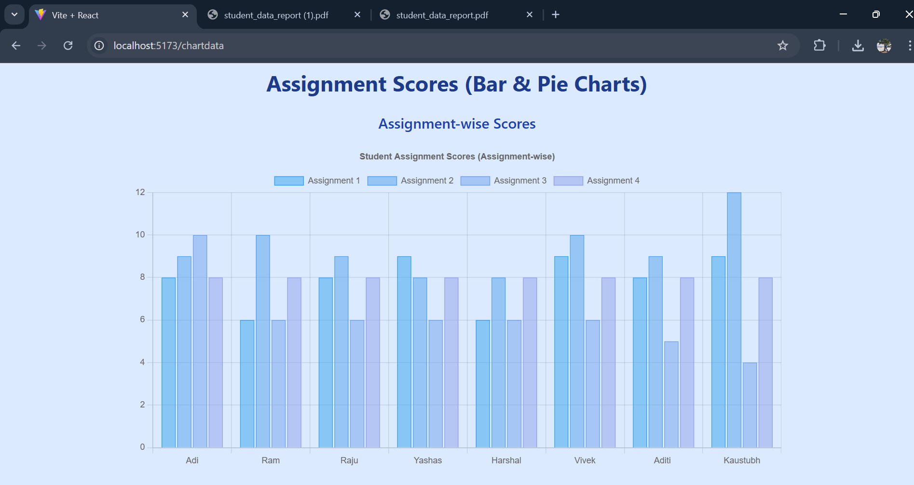
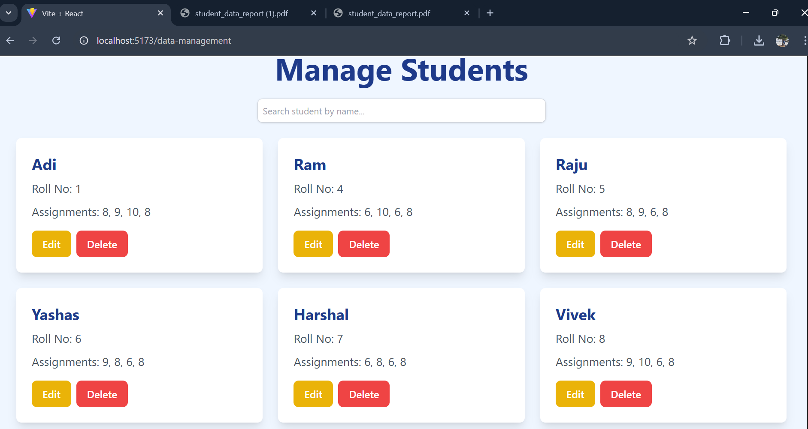

# 📊 **GradeSnap**: Smart Grading and Reporting System

**GradeSnap** is an all-in-one platform designed to simplify the grading and reporting process for teachers. It enables teachers to upload student data via Excel, manage scores, visualize performance, and generate personalized reports with ease.

---

## 🚀 **Features**

- **📥 Effortless Data Upload**: Upload student data via Excel, which is automatically added to the database.
- **🖼️ Image to Excel Conversion** *(Future Feature)*: Scan student data images, convert them into Excel files, and automatically update the database.
- **⚙️ Seamless Data Management**: Manage student records efficiently using CRUD operations (Create, Read, Update, Delete).
- **📊 Data Visualization**: View student performance data in interactive charts generated using **Chart.js**.
- **📝 Automated Term Work Calculation**: Automatically calculates internal grades based on assignment marks.
- **📑 Instant Report Generation**: Generate personalized student reports in **PDF** format by entering the student's roll number.
- **🔗 Easy Grade Sharing**: Share student grades and reports with other faculties via a unique, shareable link.

---

## 🛠 **Technologies Used**

- **Frontend**: 
  - 
  
- **Backend**: 
  -  
  - 

- **Database**: 
  - 

- **Excel Operations**: 
  - 

- **Charts**: 
  - 

- **PDF Generation**: 
  - 

---

